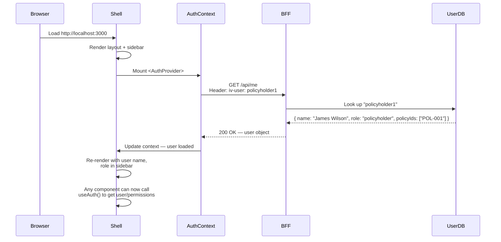
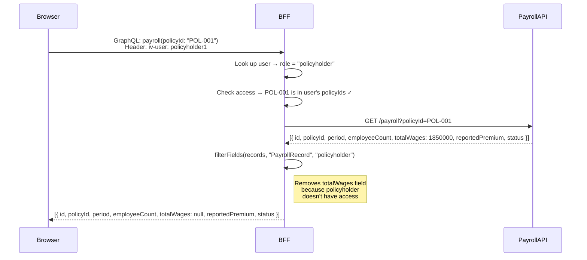
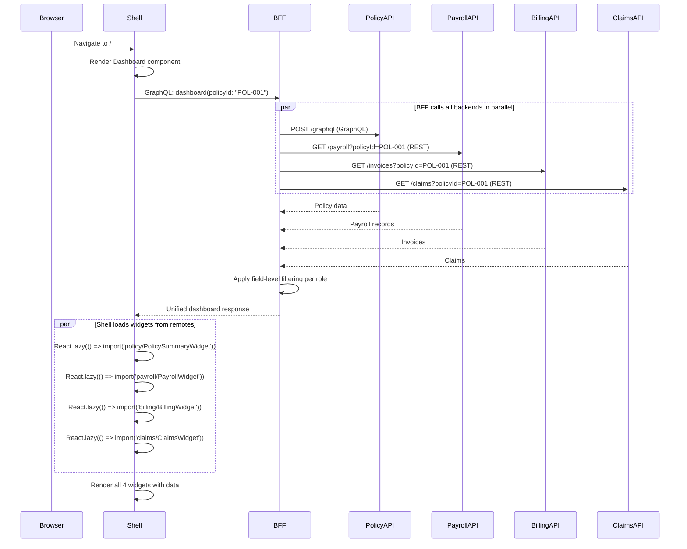
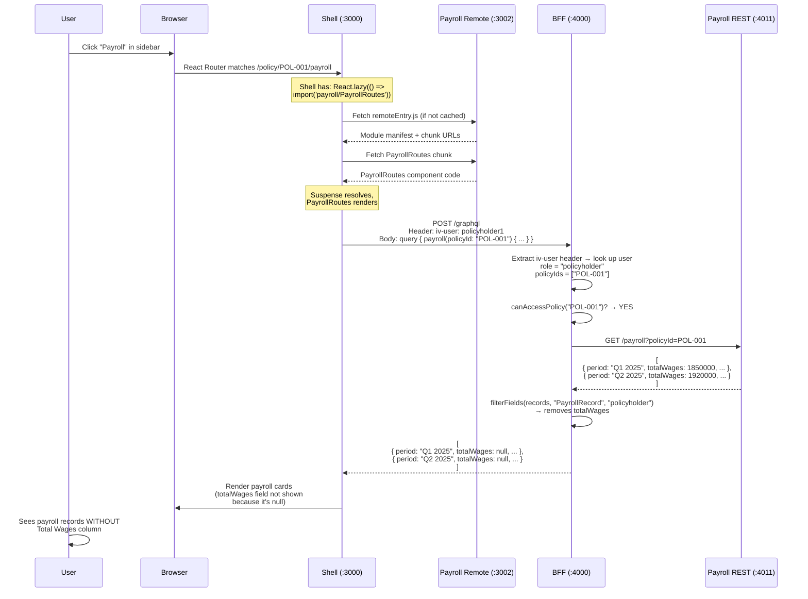

# Micro-Frontend Architecture Guide

## A complete walkthrough of how this Workers' Comp Insurance Portal works

This guide is written for developers who are new to micro-frontends. It walks you through the entire architecture — from what micro-frontends are, to how every piece of this codebase fits together. By the end, you'll understand how nine independent teams can ship features without stepping on each other.

---

## Table of Contents

1. [What is a Micro-Frontend?](#1-what-is-a-micro-frontend)
2. [The Problem We're Solving](#2-the-problem-were-solving)
3. [Architecture Overview](#3-architecture-overview)
4. [Project Structure](#4-project-structure)
5. [How Module Federation Works](#5-how-module-federation-works)
6. [The Shell (Host Application)](#6-the-shell-host-application)
7. [Remote Applications (Verticals)](#7-remote-applications-verticals)
8. [The BFF (Backend for Frontend)](#8-the-bff-backend-for-frontend)
9. [Authentication Flow](#9-authentication-flow)
10. [Data Governance — Field-Level Access Control](#10-data-governance--field-level-access-control)
11. [Dashboard Aggregation](#11-dashboard-aggregation)
12. [Shared Libraries](#12-shared-libraries)
13. [How to Run the Project](#13-how-to-run-the-project)
14. [Request Lifecycle — End to End](#14-request-lifecycle--end-to-end)
15. [Key Concepts Glossary](#15-key-concepts-glossary)

---

## 1. What is a Micro-Frontend?

A **micro-frontend** is the frontend equivalent of a microservice. Instead of one giant frontend application that every team works in, you split the UI into independent pieces — each owned by a separate team, each deployable on its own.

Think of it like this:

```
Traditional Frontend:
  One big app → One repo → One deploy → Every team waits for each other

Micro-Frontend:
  Shell (layout + routing)
    ├── Policy module    → Team A deploys independently
    ├── Billing module   → Team B deploys independently
    ├── Claims module    → Team C deploys independently
    └── Payroll module   → Team D deploys independently
```

The **shell** is the container application. It provides the shared layout (header, sidebar, navigation) and loads each team's module at runtime. The modules are called **remotes**.

### Why not just use npm packages?

With npm packages, every time Team A updates their module, the entire application must be rebuilt and redeployed. With micro-frontends using **Module Federation**, Team A deploys their module to a CDN, and the shell picks it up on the next page load — no rebuild of the shell required.

---

## 2. The Problem We're Solving

This portal serves a workers' compensation insurance carrier. Nine vertical teams (Policy, Payroll, Billing, Claims, Quoting, Cancellation, Notification, Mails, Documents) each have:

- Their own backend APIs (some REST, some GraphQL, some gRPC)
- Independent delivery timelines
- Different data sensitivity requirements (brokers see more than policyholders)

We need:
- A **unified user experience** (one portal, not nine separate apps)
- **Independent deployments** (Billing team ships without waiting for Claims team)
- **Data governance** (field-level access control based on user role)
- A **single authentication mechanism** that works across all verticals

This POC implements 4 of the 9 verticals: **Policy, Payroll, Billing, and Claims**.

---

## 3. Architecture Overview

```
┌─────────────────────────────────────────────────────────────────────┐
│                         User's Browser                              │
│                                                                     │
│  ┌───────────────────────────────────────────────────────────────┐  │
│  │                    Shell (Host) :3000                          │  │
│  │  ┌─────────┐ ┌─────────┐ ┌─────────┐ ┌─────────────────────┐│  │
│  │  │ Sidebar  │ │ Header  │ │  Auth   │ │    Route Outlet     ││  │
│  │  │  Nav     │ │         │ │ Context │ │                     ││  │
│  │  └─────────┘ └─────────┘ └─────────┘ │  ┌───────────────┐  ││  │
│  │                                       │  │ Policy Remote  │  ││  │
│  │  Loads at runtime via                 │  │    :3001       │  ││  │
│  │  Module Federation:                   │  ├───────────────┤  ││  │
│  │   - policy@:3001/remoteEntry.js       │  │ Payroll Remote │  ││  │
│  │   - payroll@:3002/remoteEntry.js      │  │    :3002       │  ││  │
│  │   - billing@:3003/remoteEntry.js      │  ├───────────────┤  ││  │
│  │   - claims@:3004/remoteEntry.js       │  │ Billing Remote │  ││  │
│  │                                       │  │    :3003       │  ││  │
│  │                                       │  ├───────────────┤  ││  │
│  │                                       │  │ Claims Remote  │  ││  │
│  │                                       │  │    :3004       │  ││  │
│  │                                       │  └───────────────┘  ││  │
│  │                                       └─────────────────────┘│  │
│  └───────────────────────────────────────────────────────────────┘  │
│                              │                                      │
│                    GraphQL queries                                   │
│                              │                                      │
└──────────────────────────────┼──────────────────────────────────────┘
                               │
                               ▼
                 ┌─────────────────────────┐
                 │     BFF (Fastify)       │
                 │     :4000               │
                 │                         │
                 │  • Auth middleware       │
                 │  • GraphQL schema       │
                 │  • Field-level filtering │
                 │  • Protocol translation  │
                 └────────┬────────────────┘
                          │
            ┌─────────────┼─────────────────────┐
            │             │                     │
            ▼             ▼                     ▼
     ┌────────────┐ ┌──────────┐  ┌──────────┐ ┌──────────┐
     │  Policy    │ │ Payroll  │  │ Billing  │ │ Claims   │
     │  GraphQL   │ │  REST    │  │  REST    │ │  REST    │
     │  :4010     │ │  :4011   │  │  :4012   │ │  :4013   │
     └────────────┘ └──────────┘  └──────────┘ └──────────┘
```

Key insight: **the BFF talks to backends using whatever protocol they expose** (GraphQL for Policy, REST for the others). It presents a single, unified GraphQL API to the frontend. The frontend never calls the backend APIs directly.

---

## 4. Project Structure

```
micro-front-end/
│
├── apps/
│   ├── shell/                    # Host app — the container
│   ├── policy/                   # Remote — Policy vertical
│   ├── payroll/                  # Remote — Payroll vertical
│   ├── billing/                  # Remote — Billing vertical
│   ├── claims/                   # Remote — Claims vertical
│   ├── bff/                      # Backend for Frontend (Node.js/Fastify)
│   └── mock-servers/             # Mock backend APIs
│
├── libs/
│   └── shared/
│       ├── auth/                 # Authentication context + hooks
│       ├── design-system/        # Shared UI components
│       └── types/                # Shared TypeScript types
│
├── tailwind.config.ts            # Shared design tokens
├── postcss.config.js             # PostCSS config for Tailwind
├── tsconfig.base.json            # Shared TypeScript config
├── nx.json                       # Nx workspace config
└── package.json                  # Root package.json with scripts
```

### Why this structure matters

- **`apps/`** contains independently deployable applications. In production, each remote would have its own CI/CD pipeline.
- **`libs/shared/`** contains code that multiple apps import. This is the "contract" between teams — the design system, the auth hooks, and the shared types.
- The root config files (`tailwind.config.ts`, `tsconfig.base.json`) ensure consistency across all apps.

---

## 5. How Module Federation Works

Module Federation is the technology that makes micro-frontends possible at runtime. Here's the mental model:

### The Problem

Normally, when you `import Button from './Button'`, the bundler resolves that at **build time**. The Button code gets baked into your bundle. If Button changes, you must rebuild.

### The Solution

Module Federation lets you `import Button from 'otherApp/Button'` where `otherApp` is a **separate application running on a different server**. The import is resolved at **runtime** — the browser fetches the code from the other server when needed.

### How it works in this project

Each remote app produces a file called `remoteEntry.js`. This is the "manifest" that tells the shell what modules are available and how to load them.

```
Shell (host) loads:
  http://localhost:3001/remoteEntry.js  → "I'm the policy remote, I expose PolicyRoutes and PolicySummaryWidget"
  http://localhost:3002/remoteEntry.js  → "I'm the payroll remote, I expose PayrollRoutes and PayrollWidget"
  http://localhost:3003/remoteEntry.js  → "I'm the billing remote, I expose BillingRoutes and BillingWidget"
  http://localhost:3004/remoteEntry.js  → "I'm the claims remote, I expose ClaimsRoutes and ClaimsWidget"
```

### Configuration — Remote side

Each remote declares what it **exposes**. Here's the Policy remote:

> **File:** [`apps/policy/rspack.config.ts`](../apps/policy/rspack.config.ts)

```ts
new ModuleFederationPlugin({
  name: 'policy',                          // unique name for this remote
  filename: 'remoteEntry.js',             // the manifest file
  exposes: {
    './PolicyRoutes': './src/app/PolicyRoutes',           // full page component
    './PolicySummaryWidget': './src/app/PolicySummaryWidget',  // dashboard widget
  },
  shared: {
    react: { singleton: true },            // share ONE copy of React
    'react-dom': { singleton: true },      // across shell + all remotes
    'react-router-dom': { singleton: true },
  },
})
```

**What `exposes` means:** Any other app can import these modules. `'./PolicyRoutes'` means other apps write `import PolicyRoutes from 'policy/PolicyRoutes'`.

**What `shared: { singleton: true }` means:** React must only exist once in the browser. Without this, the shell and each remote would each load their own copy of React, and hooks would break (React context wouldn't work across boundaries).

### Configuration — Host side

The shell declares where to find each remote:

> **File:** [`apps/shell/rspack.config.ts`](../apps/shell/rspack.config.ts)

```ts
new ModuleFederationPlugin({
  name: 'shell',
  remotes: {
    policy:  'policy@http://localhost:3001/remoteEntry.js',
    payroll: 'payroll@http://localhost:3002/remoteEntry.js',
    billing: 'billing@http://localhost:3003/remoteEntry.js',
    claims:  'claims@http://localhost:3004/remoteEntry.js',
  },
  shared: {
    react: { singleton: true, eager: false },
    'react-dom': { singleton: true, eager: false },
    'react-router-dom': { singleton: true, eager: false },
  },
})
```

**What `remotes` means:** When the shell code writes `import('policy/PolicyRoutes')`, the bundler knows to fetch it from `http://localhost:3001/remoteEntry.js`.

### The async boundary

There's one critical pattern. The entry point of every app (shell and remotes) uses a **dynamic import**:

> **File:** [`apps/shell/src/entry.ts`](../apps/shell/src/entry.ts)

```ts
import('./bootstrap');
```

This one-line file exists because Module Federation needs the shared dependencies (React, etc.) to be negotiated **before** any app code runs. The dynamic `import()` creates an async boundary that gives Module Federation time to set up the shared singletons.

> **File:** [`apps/shell/src/bootstrap.tsx`](../apps/shell/src/bootstrap.tsx)

```ts
import React from 'react';
import { createRoot } from 'react-dom/client';
import App from './app/App';

const container = document.getElementById('root');
if (container) {
  createRoot(container).render(<App />);
}
```

**Pattern:** `entry.ts` → dynamic import → `bootstrap.tsx` → actual app code. Every Module Federation app follows this pattern.

---

## 6. The Shell (Host Application)

The shell is the "container" that users actually load in their browser. It owns:

1. **Layout** — sidebar, navigation, user info
2. **Routing** — decides which remote to load based on the URL
3. **Auth context** — fetches user identity, provides it to all remotes
4. **Dashboard** — aggregates widgets from all remotes

### App entry point

> **File:** [`apps/shell/src/app/App.tsx`](../apps/shell/src/app/App.tsx)

```tsx
export default function App() {
  return (
    <AuthProvider bffBaseUrl="http://localhost:4000">   {/* Auth wraps everything */}
      <BrowserRouter>
        <Routes>
          <Route element={<ShellLayout />}>              {/* Shared layout */}
            <Route path="/" element={<Dashboard />} />
            <Route path="/policy/:policyId" element={
              <Suspense fallback={<LoadingFallback />}>
                <PolicyRoutes />                          {/* Loaded from remote! */}
              </Suspense>
            } />
            {/* ... other routes ... */}
          </Route>
        </Routes>
      </BrowserRouter>
    </AuthProvider>
  );
}
```

Key things to notice:
- **`<AuthProvider>`** wraps everything, so any remote component can call `useAuth()` to get the current user
- **`<Suspense>`** wraps remote imports — because they're loaded over the network, they might take a moment
- **`<PolicyRoutes />`** looks like a normal component, but it's actually loaded from `http://localhost:3001`

The remote components are imported at the top of the file:

```tsx
const PolicyRoutes = React.lazy(() => import('policy/PolicyRoutes'));
const PayrollRoutes = React.lazy(() => import('payroll/PayrollRoutes'));
```

`React.lazy()` + `import()` = the browser fetches the code from the remote server only when the route is visited.

### Shell layout

> **File:** [`apps/shell/src/app/layout/ShellLayout.tsx`](../apps/shell/src/app/layout/ShellLayout.tsx)

This renders the sidebar with navigation links and an `<Outlet />` where the current route's content appears. It also contains the **role switcher** dropdown (for the POC) and displays the authenticated user's name and role.

### Type declarations for remotes

> **File:** [`apps/shell/src/remotes.d.ts`](../apps/shell/src/remotes.d.ts)

TypeScript doesn't know about Module Federation remotes. This file tells the compiler what types to expect:

```ts
declare module 'policy/PolicyRoutes' {
  const Component: React.ComponentType;
  export default Component;
}
```

Without this, TypeScript would error on `import('policy/PolicyRoutes')`.

---

## 7. Remote Applications (Verticals)

Each remote is a standalone React app that can run independently for development, but is designed to be loaded inside the shell.

### Structure of a remote (using Policy as example)

```
apps/policy/
├── rspack.config.ts          # Module Federation config (what to expose)
├── src/
│   ├── entry.ts              # Async boundary (one line: import('./bootstrap'))
│   ├── bootstrap.tsx          # Standalone dev entry point
│   └── app/
│       ├── PolicyRoutes.tsx           # Full page — exposed to shell
│       └── PolicySummaryWidget.tsx    # Dashboard widget — exposed to shell
```

### What a remote exposes

Each remote exposes two things:
1. **A route component** — the full-page view (e.g., `PolicyRoutes` renders the policy detail page)
2. **A widget component** — a small summary for the dashboard (e.g., `PolicySummaryWidget`)

> **File:** [`apps/policy/src/app/PolicyRoutes.tsx`](../apps/policy/src/app/PolicyRoutes.tsx)

This component:
- Reads `:policyId` from the URL (provided by the shell's router)
- Calls the BFF's GraphQL API to fetch policy data
- Renders the policy detail view using shared design system components

> **File:** [`apps/policy/src/app/PolicySummaryWidget.tsx`](../apps/policy/src/app/PolicySummaryWidget.tsx)

This component:
- Receives a `policy` prop from the dashboard (the dashboard fetches the data)
- Renders a compact card summary

### Standalone development

Each remote has a `bootstrap.tsx` that wraps it in a `BrowserRouter` so it can run on its own:

> **File:** [`apps/policy/src/bootstrap.tsx`](../apps/policy/src/bootstrap.tsx)

```tsx
function StandaloneApp() {
  return (
    <BrowserRouter>
      <div className="p-6">
        <Routes>
          <Route path="/policy/:policyId" element={<PolicyRoutes />} />
        </Routes>
      </div>
    </BrowserRouter>
  );
}
```

This means a developer on the Policy team can run `npm run start:policy` and work on their vertical without starting the shell or other remotes.

### All four remotes

| Remote | Port | Exposes | File |
|--------|------|---------|------|
| Policy | 3001 | `PolicyRoutes`, `PolicySummaryWidget` | [`apps/policy/rspack.config.ts`](../apps/policy/rspack.config.ts) |
| Payroll | 3002 | `PayrollRoutes`, `PayrollWidget` | [`apps/payroll/rspack.config.ts`](../apps/payroll/rspack.config.ts) |
| Billing | 3003 | `BillingRoutes`, `BillingWidget` | [`apps/billing/rspack.config.ts`](../apps/billing/rspack.config.ts) |
| Claims | 3004 | `ClaimsRoutes`, `ClaimsWidget` | [`apps/claims/rspack.config.ts`](../apps/claims/rspack.config.ts) |

---

## 8. The BFF (Backend for Frontend)

The BFF is the single API that the frontend talks to. It sits between the browser and the backend services.

### Why a BFF?

The backend services use different protocols (Policy uses GraphQL, others use REST). They each have their own authentication (HMAC signing). Some return fields that certain users shouldn't see. The BFF handles all of this:

```
Browser → BFF → Policy backend (GraphQL)
              → Payroll backend (REST)
              → Billing backend (REST)
              → Claims backend (REST)
```

The frontend sends one GraphQL query. The BFF fans it out to the right backends, in the right protocol, applies field-level filtering, and returns a unified response.

### BFF entry point

> **File:** [`apps/bff/src/main.ts`](../apps/bff/src/main.ts)

Sets up Fastify with:
- CORS (so the browser can call it from a different port)
- Apollo Server (GraphQL endpoint at `/graphql`)
- A REST endpoint `/api/me` for the auth context to fetch user info
- Auth context extraction — reads `iv-user` header, looks up the user, and passes it to GraphQL resolvers

### GraphQL schema

> **File:** [`apps/bff/src/schema/typeDefs.ts`](../apps/bff/src/schema/typeDefs.ts)

Defines the **contract** between the frontend and the BFF. This is the single source of truth for what data the frontend can request.

Notice some fields are nullable (e.g., `totalWages: Float`, `claimantName: String`) — these are fields that get set to `null` for users who don't have permission to see them.

### Resolvers — where the magic happens

> **File:** [`apps/bff/src/schema/resolvers.ts`](../apps/bff/src/schema/resolvers.ts)

Each resolver:
1. Checks if the user can access the requested policy
2. Calls the appropriate backend (GraphQL or REST)
3. Filters the response based on the user's role
4. Returns the filtered data

**Calling a GraphQL backend (Policy):**

```ts
policy: async (_, { policyId }, context) => {
  if (!canAccessPolicy(context.user, policyId)) {
    throw new Error('Access denied');
  }
  const data = await fetchGraphQL(POLICY_GRAPHQL, `
    query ($policyId: String!) {
      policy(policyId: $policyId) {
        policyId holderName status effectiveDate expirationDate premium type
      }
    }
  `, { policyId });
  return data.policy;
},
```

**Calling a REST backend (Payroll):**

```ts
payroll: async (_, { policyId }, context) => {
  if (!canAccessPolicy(context.user, policyId)) {
    throw new Error('Access denied');
  }
  const records = await fetchJson(`${PAYROLL_API}/payroll?policyId=${policyId}`);
  return filterFields(records, 'PayrollRecord', context.user.role);
},
```

The frontend doesn't know or care that Policy is GraphQL and Payroll is REST. It sends the same kind of GraphQL query for both.

### Mock backend servers

> **File:** [`apps/mock-servers/src/data.ts`](../apps/mock-servers/src/data.ts) — All mock data lives here

| Backend | Protocol | Port | File |
|---------|----------|------|------|
| Policy | **GraphQL** | 4010 | [`apps/mock-servers/src/servers/policy-server.ts`](../apps/mock-servers/src/servers/policy-server.ts) |
| Payroll | REST | 4011 | [`apps/mock-servers/src/servers/payroll-server.ts`](../apps/mock-servers/src/servers/payroll-server.ts) |
| Billing | REST | 4012 | [`apps/mock-servers/src/servers/billing-server.ts`](../apps/mock-servers/src/servers/billing-server.ts) |
| Claims | REST | 4013 | [`apps/mock-servers/src/servers/claims-server.ts`](../apps/mock-servers/src/servers/claims-server.ts) |

---

## 9. Authentication Flow

In production, IBM TAM (Tivoli Access Manager) sits as a reverse proxy in front of everything. It handles SSO and injects `iv-user` and `iv-groups` HTTP headers into every request. The application never sees passwords.

For this POC, we simulate TAM by storing the user identity in `localStorage` and sending it as a header.

### Sequence diagram



### Auth middleware (BFF side)

> **File:** [`apps/bff/src/middleware/auth.ts`](../apps/bff/src/middleware/auth.ts)

```ts
// Simulated user database
const USER_DB = {
  broker1: { id: 'broker1', name: 'Sarah Chen', role: 'broker', policyIds: ['POL-001', 'POL-002', 'POL-003'] },
  policyholder1: { id: 'policyholder1', name: 'James Wilson', role: 'policyholder', policyIds: ['POL-001'] },
  admin1: { id: 'admin1', name: 'Admin User', role: 'internal_admin', policyIds: ['POL-001', 'POL-002', 'POL-003'] },
};
```

**Extension points for real TAM integration are documented in the code comments:**
1. Replace `USER_DB` with a real database lookup
2. Validate `iv-groups` header for group-based access
3. Add session caching (Redis) to avoid DB lookups on every request

### Auth context (frontend side)

> **File:** [`libs/shared/auth/src/AuthContext.tsx`](../libs/shared/auth/src/AuthContext.tsx)

Provides `useAuth()` hook that any component (in any remote) can use:

```tsx
const { user, hasRole, hasPermission, isLoading } = useAuth();

if (hasRole('broker'))           // → show broker-only UI
if (hasPermission('edit:payroll')) // → show edit button
```

The permission matrix is defined in the same file — mapping roles to permissions:

```ts
const ROLE_PERMISSIONS = {
  broker: ['view:policy', 'view:payroll', 'view:billing', 'view:claims',
           'view:book_of_business', 'edit:payroll', 'view:employee_details'],
  policyholder: ['view:policy', 'view:payroll', 'view:billing', 'view:claims'],
  internal_admin: [/* everything */],
};
```

### PermissionGate component

> **File:** [`libs/shared/auth/src/PermissionGate.tsx`](../libs/shared/auth/src/PermissionGate.tsx)

A declarative way to conditionally render UI based on permissions:

```tsx
<PermissionGate permission="edit:payroll">
  <button>Edit Payroll</button>  {/* Only visible to brokers/admins */}
</PermissionGate>
```

---

## 10. Data Governance — Field-Level Access Control

This is the most important architectural feature. Different roles see different fields — **enforced at the BFF layer**, not in the browser.

### The rule matrix

> **File:** [`apps/bff/src/schema/resolvers.ts`](../apps/bff/src/schema/resolvers.ts) (lines 9-26)

```ts
const FIELD_RULES = {
  PayrollRecord: {
    broker:       ['id', 'policyId', 'period', 'employeeCount', 'totalWages', 'reportedPremium', 'status'],
    policyholder: ['id', 'policyId', 'period', 'employeeCount', 'reportedPremium', 'status'],
    //                                                           ^^^ no totalWages!
  },
  Claim: {
    broker:       ['id', 'policyId', 'claimantName', 'dateOfInjury', 'status', 'description', 'amount', 'filedDate'],
    policyholder: ['id', 'policyId', 'dateOfInjury', 'status', 'description', 'filedDate'],
    //                               ^^^ no claimantName! ^^^ no amount!
  },
};
```

### How filtering works



### What each role sees

**Payroll page:**
| Field | Policyholder | Broker | Admin |
|-------|:---:|:---:|:---:|
| Period | Yes | Yes | Yes |
| Employee Count | Yes | Yes | Yes |
| **Total Wages** | **null** | **$1,850,000** | **$1,850,000** |
| Reported Premium | Yes | Yes | Yes |
| Status | Yes | Yes | Yes |

**Claims page:**
| Field | Policyholder | Broker | Admin |
|-------|:---:|:---:|:---:|
| Claim ID | Yes | Yes | Yes |
| Status | Yes | Yes | Yes |
| **Claimant Name** | **null** | **John Smith** | **John Smith** |
| Date of Injury | Yes | Yes | Yes |
| Description | Yes | Yes | Yes |
| **Amount** | **null** | **$15,000** | **$15,000** |
| Filed Date | Yes | Yes | Yes |

### Why this is done in the BFF, not the browser

If you filtered fields in the browser (React components), a tech-savvy user could open DevTools and see the full data in the network response. By filtering in the BFF, **the data never leaves the server** for unauthorized fields.

### Policy-level access control

Beyond field filtering, the BFF also enforces **which policies a user can access**:

```ts
function canAccessPolicy(user: User, policyId: string): boolean {
  return user.policyIds.includes(policyId);
}
```

A policyholder who owns POL-001 cannot query POL-002. The BFF returns an error:

```json
{
  "errors": [{ "message": "Access denied: you do not have access to this policy" }]
}
```

---

## 11. Dashboard Aggregation

The dashboard is the best demonstration of micro-frontend composition. It loads **one widget from each remote** and feeds them data from a single BFF query.

### Sequence diagram



### Dashboard component

> **File:** [`apps/shell/src/app/Dashboard.tsx`](../apps/shell/src/app/Dashboard.tsx)

Key aspects:

1. **Lazy loading remote widgets:**
```tsx
const PolicySummaryWidget = React.lazy(() => import('policy/PolicySummaryWidget'));
const PayrollWidget = React.lazy(() => import('payroll/PayrollWidget'));
const BillingWidget = React.lazy(() => import('billing/BillingWidget'));
const ClaimsWidget = React.lazy(() => import('claims/ClaimsWidget'));
```

2. **Single GraphQL query to the BFF:**
```tsx
fetch('http://localhost:4000/graphql', {
  method: 'POST',
  headers: { 'Content-Type': 'application/json', 'iv-user': '...' },
  body: JSON.stringify({
    query: `query Dashboard($policyId: String!) {
      dashboard(policyId: $policyId) {
        policy { policyId holderName status premium }
        recentPayroll { period employeeCount totalWages reportedPremium status }
        recentInvoices { id amount dueDate status }
        openClaims { id claimantName dateOfInjury status description amount }
      }
    }`,
    variables: { policyId },
  }),
})
```

3. **Error boundaries per widget** — if one remote fails to load, the others still work:
```tsx
<WidgetErrorBoundary name="Policy Remote">
  <Suspense fallback={<WidgetFallback name="Policy" />}>
    <PolicySummaryWidget policy={data?.policy} />
  </Suspense>
</WidgetErrorBoundary>
```

### BFF dashboard resolver

> **File:** [`apps/bff/src/schema/resolvers.ts`](../apps/bff/src/schema/resolvers.ts) (dashboard query)

Uses `Promise.allSettled()` so that if one backend is slow or down, the others still return data:

```ts
const [policyResult, payroll, invoicesData, claimsData] = await Promise.allSettled([
  fetchGraphQL(POLICY_GRAPHQL, ...),   // GraphQL call
  fetchJson(`${PAYROLL_API}/...`),      // REST call
  fetchJson(`${BILLING_API}/...`),      // REST call
  fetchJson(`${CLAIMS_API}/...`),       // REST call
]);
```

If the Claims backend is down, the dashboard still shows Policy, Payroll, and Billing data.

---

## 12. Shared Libraries

Shared libraries live in `libs/shared/` and are imported by all apps directly (not as npm packages).

### Types

> **File:** [`libs/shared/types/src/index.ts`](../libs/shared/types/src/index.ts)

Domain types shared across all verticals: `Policy`, `PayrollRecord`, `Invoice`, `Claim`, `User`, `DashboardData`. When the Policy team adds a field, all verticals that use the `Policy` type get compile-time errors if they need to update.

### Auth

> **File:** [`libs/shared/auth/src/index.ts`](../libs/shared/auth/src/index.ts)

Exports `AuthProvider`, `useAuth`, and `PermissionGate`. Used by the shell and available to any remote via React context (because React is a shared singleton).

### Design System

> **File:** [`libs/shared/design-system/src/index.ts`](../libs/shared/design-system/src/index.ts)

Simple, shared UI components:

| Component | Purpose | File |
|-----------|---------|------|
| `Card` | Container with optional colored left border | [`Card.tsx`](../libs/shared/design-system/src/components/Card.tsx) |
| `Badge` | Status indicators (success, warning, danger) | [`Badge.tsx`](../libs/shared/design-system/src/components/Badge.tsx) |
| `DataField` | Label + value pair | [`DataField.tsx`](../libs/shared/design-system/src/components/DataField.tsx) |
| `PageHeader` | Page title with vertical indicator badge | [`PageHeader.tsx`](../libs/shared/design-system/src/components/PageHeader.tsx) |
| `ErrorFallback` | Error state when a remote fails to load | [`ErrorFallback.tsx`](../libs/shared/design-system/src/components/ErrorFallback.tsx) |

Each vertical uses the same components, ensuring visual consistency. The vertical identity is shown through colored accents:
- **Policy** — blue
- **Payroll** — green
- **Billing** — orange
- **Claims** — red

---

## 13. How to Run the Project

### Prerequisites

- Node.js 18+
- npm 9+

### Quick start (everything at once)

```bash
npm run dev
```

This starts **all 9 processes** using `concurrently`:

| Process | Port | What it is |
|---------|------|------------|
| Policy mock (GraphQL) | 4010 | Backend API |
| Payroll mock (REST) | 4011 | Backend API |
| Billing mock (REST) | 4012 | Backend API |
| Claims mock (REST) | 4013 | Backend API |
| BFF | 4000 | GraphQL gateway |
| Shell | 3000 | Host app (open this in browser) |
| Policy remote | 3001 | Micro-frontend |
| Payroll remote | 3002 | Micro-frontend |
| Billing remote | 3003 | Micro-frontend |
| Claims remote | 3004 | Micro-frontend |

Open **http://localhost:3000** in your browser.

### Starting layers independently

```bash
# Just the backends
npm run start:backends

# Just the remotes
npm run start:remotes

# Just the shell
npm run start:shell

# Just the BFF
npm run start:bff

# Individual remote for focused development
npm run start:policy
npm run start:payroll
npm run start:billing
npm run start:claims
```

### Testing the role switcher

Use the dropdown in the bottom-left sidebar to switch between:
- **Policyholder (James Wilson)** — sees limited fields, only POL-001
- **Broker (Sarah Chen)** — sees all fields, all policies
- **Admin** — sees everything

### Testing the GraphQL API directly

Open **http://localhost:4000/graphql** for the Apollo Sandbox.

Try these queries:

```graphql
# As a broker (add header: iv-user: broker1)
{
  dashboard(policyId: "POL-001") {
    policy { policyId holderName }
    recentPayroll { period totalWages }
    openClaims { claimantName amount }
  }
}
```

```graphql
# As a policyholder (add header: iv-user: policyholder1)
# totalWages, claimantName, and amount will be null
{
  dashboard(policyId: "POL-001") {
    policy { policyId holderName }
    recentPayroll { period totalWages }
    openClaims { claimantName amount }
  }
}
```

---

## 14. Request Lifecycle — End to End

Here's exactly what happens when a user navigates to the **Payroll** page as a **policyholder**.



---

## 15. Key Concepts Glossary

| Term | Definition |
|------|-----------|
| **Shell / Host** | The container application that provides layout, routing, and loads remotes. Users navigate to the shell's URL. |
| **Remote** | An independently built and deployed micro-frontend that the shell loads at runtime. |
| **Module Federation** | A bundler feature (Webpack 5 / Rspack) that allows JavaScript modules to be shared between separately built applications at runtime. |
| **remoteEntry.js** | A manifest file produced by each remote that tells the host what modules are available and how to load them. |
| **Shared singleton** | A dependency (like React) that exists only once in the browser, shared between the shell and all remotes. Without this, React hooks break across boundaries. |
| **Async boundary** | The `import('./bootstrap')` pattern in `entry.ts` that gives Module Federation time to negotiate shared dependencies before app code runs. |
| **BFF (Backend for Frontend)** | A server-side layer between the frontend and backend APIs. Handles auth, protocol translation, data aggregation, and field-level access control. |
| **Rspack** | A Webpack-compatible bundler written in Rust. 5-10x faster builds, same config format and plugin API as Webpack 5. |
| **Nx** | A monorepo build system that provides affected builds, module boundary enforcement, and code generation. |
| **Field-level filtering** | The BFF removes sensitive fields from API responses based on the user's role before sending data to the browser. |
| **TAM (Tivoli Access Manager)** | IBM's reverse proxy for SSO. Injects `iv-user` and `iv-groups` headers. Our auth middleware reads these headers. |
| **HMAC signing** | A mechanism for the BFF to authenticate itself to backend APIs. Each backend has a shared secret key. |
| **`React.lazy()`** | React's built-in code-splitting mechanism. Combined with Module Federation, it loads remote components on demand. |
| **`<Suspense>`** | React component that shows a fallback while lazy-loaded components are being fetched. |
| **Error boundary** | A React component that catches rendering errors in its children and shows a fallback UI instead of crashing the entire app. |

---

## What's Next

This POC covers the core patterns. To move toward production, you would:

1. **Independent deployment** — Deploy each remote's bundle to Azure Blob Storage with a `remotes-manifest.json` that the shell reads at runtime
2. **Broker authorization** — Book of Business view, multi-policy navigation
3. **Real TAM integration** — Replace mock user DB with real LDAP/SQL lookups
4. **HMAC signing** — Pull keys from Azure Key Vault, sign outgoing requests
5. **Additional verticals** — Quoting, Cancellation, Notification, Mails, Documents
6. **Design system** — Shadcn/UI + Radix primitives for accessible, branded components
7. **Testing** — Unit tests per remote, integration tests for the shell, visual regression via Storybook + Chromatic
